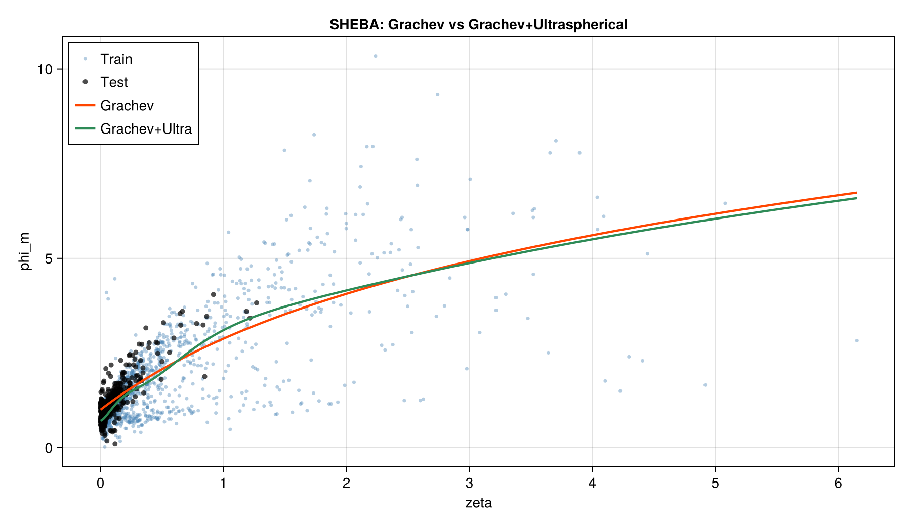
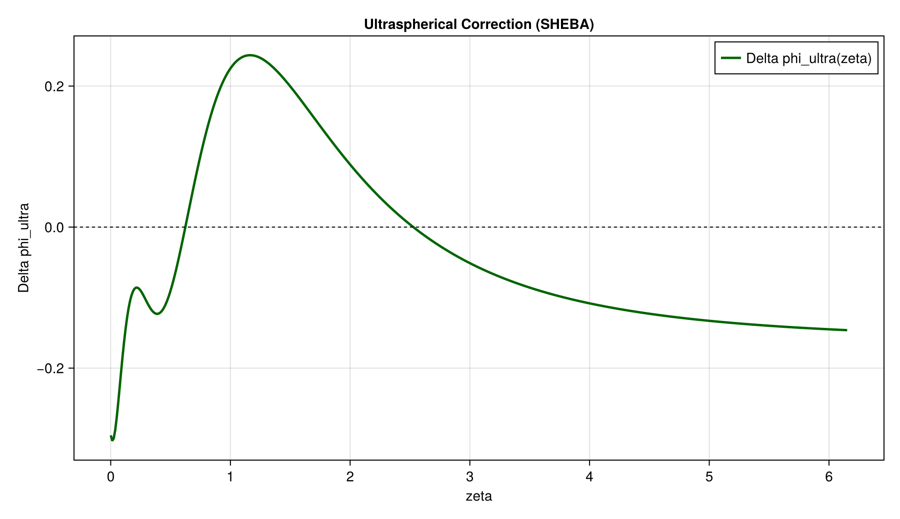

# SHEBA Ultraspherical Run Report

## Run

- run name: sheba_ultra_grachev
- dataset: SHEBA
- baseline: Grachev et al. (2007) BLM
- xi-map: tanh(alpha * log1p(zeta))  [log-scale for HSNBL]

## Metrics

| Model | RMSE test | MAE test |
|---|---|---|
| Grachev | 0.3410727610284458 | 0.2610645111520214 |
| Grachev+ULTRA | 0.3301766276026332 | 0.2256491446251999 |

Relative RMSE gain: **3.19%**

## Fitted Parameters

- baseline_mode = grachev
- a = 2.49844027746819
- b = 0.6766125007389536
- alpha_xi = 1.7427953628298036
- lambda_star = 0.75
- nmax = 5

## Coefficient Physical Meaning (HSNBL heuristics)

- c0 (mode 0 offset): 17.62639820170009
- c1 (mode 1 tilt): -32.25138311160568
- c2 (mode 2 curvature): 32.08544081666421
- Neutral-core slope in xi (2*lambda_* * c1): -48.37707466740852
- Core curvature proxy in xi (2*lambda_*(lambda_*+1)*c2): 84.22428214374355
- Dominant |coeff| mode: n=1 (fraction=28.08%)

Interpretation guide:
- n=0: bulk level shift relative to baseline.
- n=1: first-order monotonic tilt across stability (often tied to shear/jet strengthening tendency).
- n=2: primary curvature/inversion structure (how sharply phi bends with stability).
- n>=3: higher-order intermittency/wave-like structure and regime transitions.

## Inline Graphics

### Grachev vs Grachev+ULTRA

### Ultraspherical Correction

## Output Files

- sheba_ultra_grachev_metrics.csv
- sheba_ultra_grachev_params.csv
- sheba_ultra_grachev_pred_test.csv
- sheba_ultra_grachev_coeffs.csv
- sheba_ultra_grachev_curve.csv
- sheba_ultra_grachev_model.jl
- sheba_ultra_grachev_formula.md
- sheba_ultra_grachev_validity_summary.md
