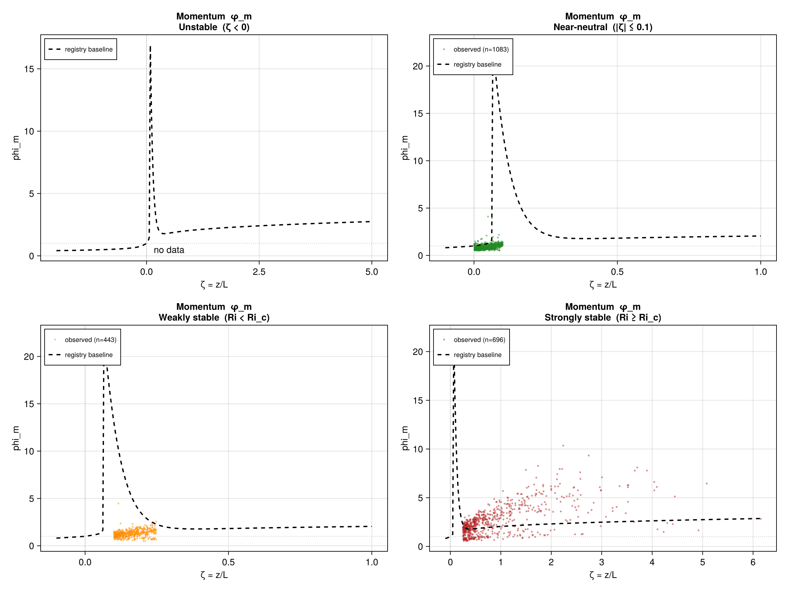
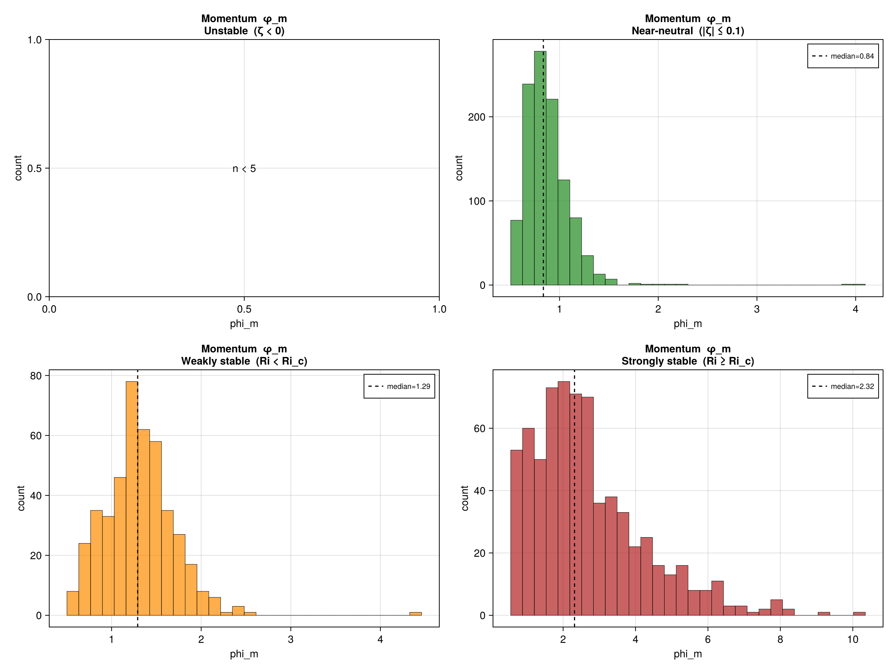
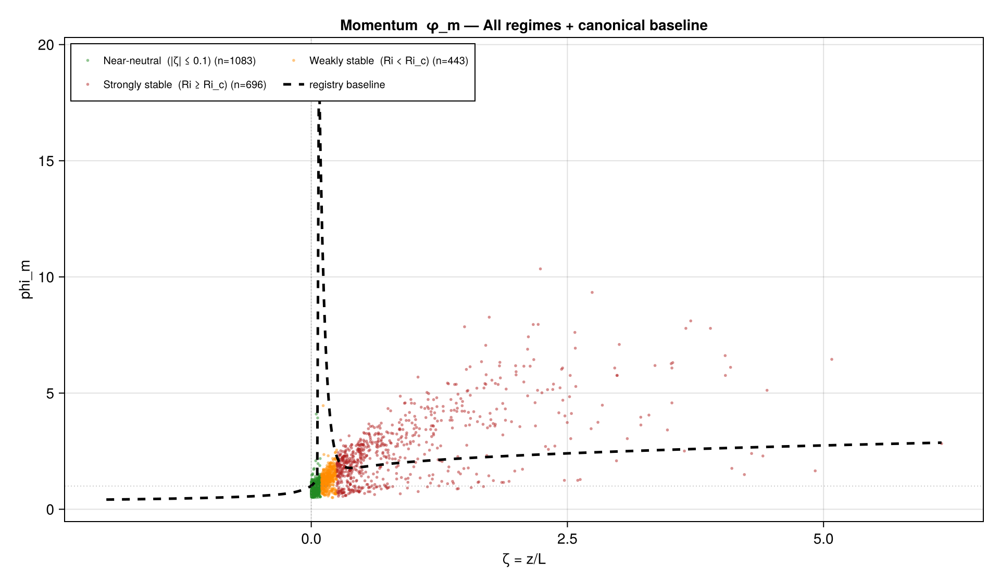
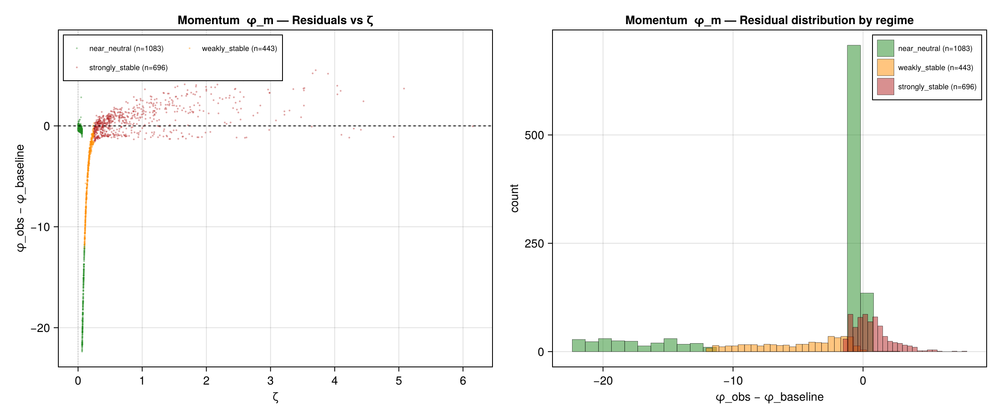

# Multi-Tracer Regime Analysis — Modeling Summary

**Dataset:** SHEBA
**Ri_c (regime boundary):** 0.25

---

## Momentum  φ_m

**Sign convention note:** phi_m is always positive; u_* is always positive — no sign ambiguity.

**Baseline family:** unstable λ=4.0 (b=16.0 → (1−16.0ζ)^{−1/4.0}); stable Grachev a=5.0, b=5.0

| Regime | n | ζ q50 | φ q50 | φ IQR | Residual RMSE | Heteroscedastic |
|---|---|---|---|---|---|---|
| Unstable  (ζ < 0) | 0 | NaN | NaN | NaN | NaN | false |
| Near-neutral  (|ζ| ≤ 0.1) | 1083 | 0.034 | 0.836 | 0.254 | 8.3073 | false |
| Weakly stable  (Ri < Ri_c) | 443 | 0.156 | 1.291 | 0.469 | 6.0944 | false |
| Strongly stable  (Ri ≥ Ri_c) | 696 | 0.627 | 2.316 | 1.867 | 1.6012 | true |

**Priority for baseline refinement:** Near-neutral  (|ζ| ≤ 0.1) (residual RMSE=8.3073)

**Plots:**
- 
- 
- 
- 

---

## Next Steps

1. For regimes with high residual RMSE: run `unified_ultra.jl --regime=<regime>` with the corresponding tracer's preprocessed CSV.
2. For heteroscedastic regimes: consider regime-specific ridge regularisation or variance-weighted fitting.
3. Review sign convention notes above for each tracer before fitting.
4. Near-neutral rows are bridging between stable and unstable baselines — inspect the C¹ tie quality before using blended fits.

## Artifacts

- diag_momentum_regime_stats.csv
- diag_momentum_by_regime.png
- diag_momentum_phi_distribution.png
- diag_momentum_baseline_overlay.png
- diag_momentum_residuals.png
