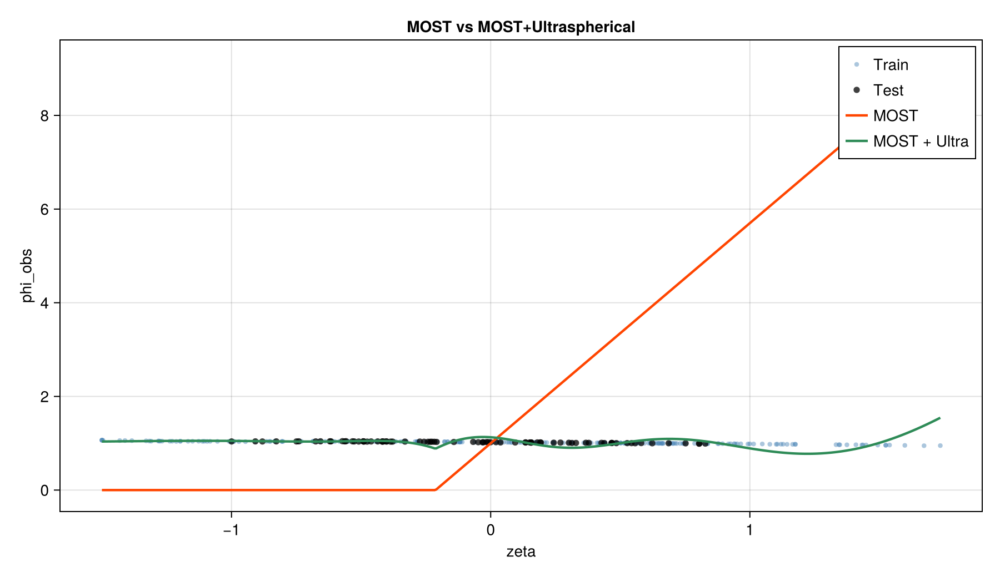
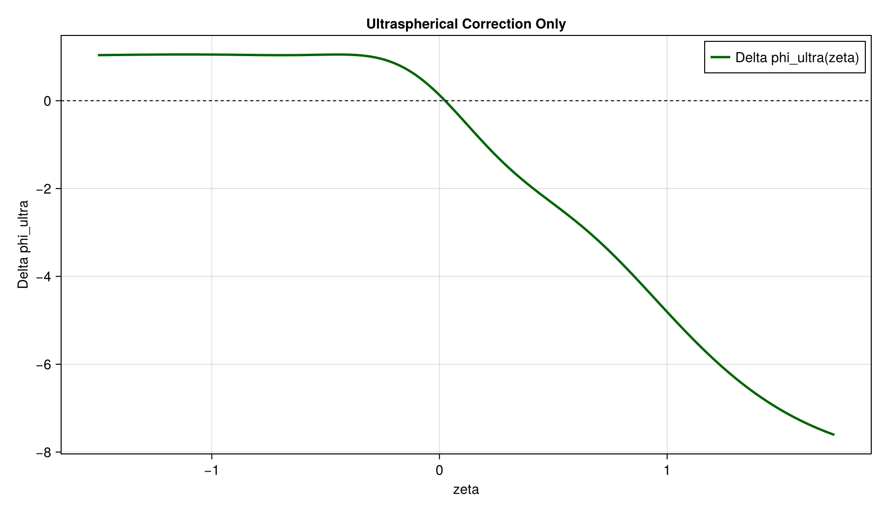

# Ultraspherical Run Report

## Run

- run name: ultra_synth
- dataset label: synthetic

## Metrics

- MOST test RMSE: 1.5465880642803642
- MOST+ULTRA test RMSE: 0.06253918294680291
- absolute RMSE gain: 1.4840488813335613
- relative RMSE gain: 95.95631284171958%

## Parameters

- baseline a: 1.0
- baseline b: 4.7
- baseline lambda_profile: -1.0
- alpha_xi: 1.2751110483723245
- lambda_star: 0.25
- ridge: 0.0001
- n_ultra: 6
- regime: all
- split_mode: blocked

## Inline Graphics

### MOST vs MOST+ULTRA

### Ultraspherical Correction

## Run Files

- ultra_synth_metrics.csv
- ultra_synth_params.csv
- ultra_synth_coeffs.csv
- ultra_synth_pred_test.csv
- ultra_synth_curve.csv
- ultra_synth_model.jl
- ultra_synth_formula.md
- ultra_synth_validity_summary.md
