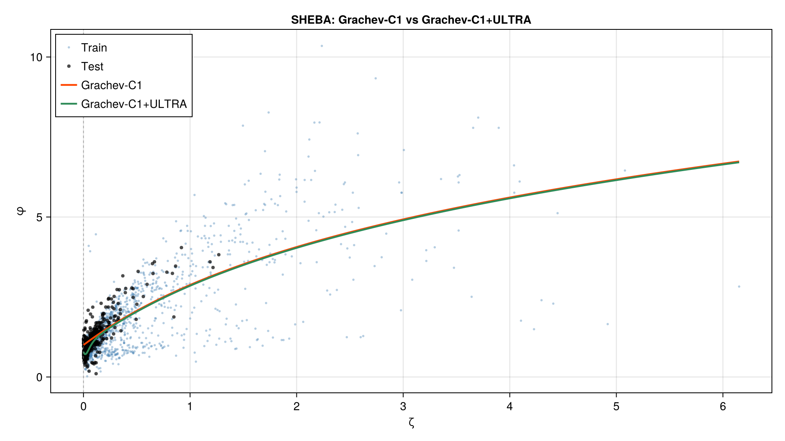
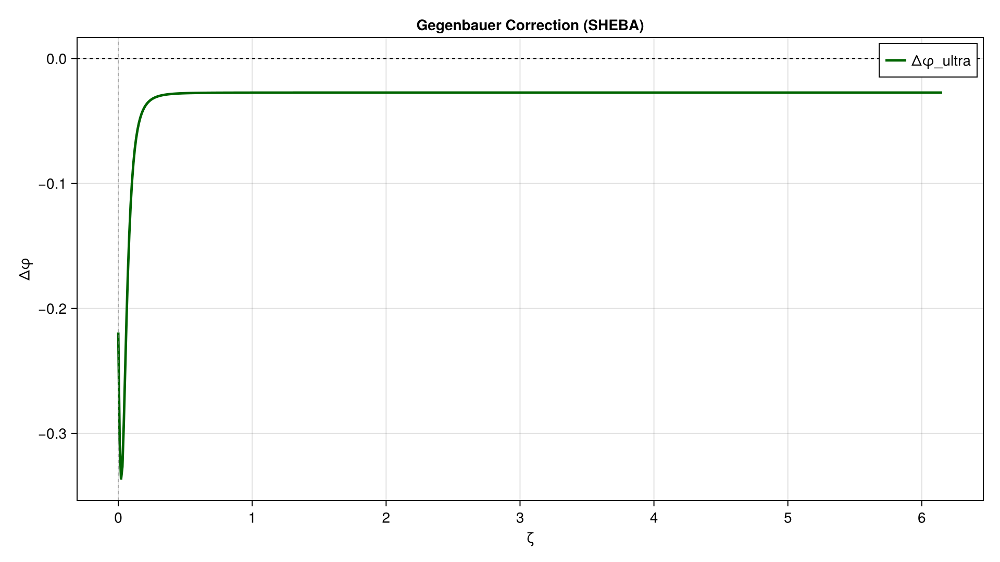

# Unified All-Regime Ultraspherical Run Report

## Run

- run: unified
- dataset: SHEBA
- regime: stable
- blend: soft
- C¹ continuity tie: no (free)
- ξ-map: tanh(a_ξ · asinh(ζ/ζ₀))  [all-regime, log tails]

## Metrics (held-out test set)

| Model | RMSE | MAE |
|---|---|---|
| Grachev-C1 | 0.34107 | 0.26106 |
| Grachev-C1+ULTRA    | 0.3204 | 0.21651 |

Relative RMSE gain: **6.06%**

## Baseline Parameters

| param | value | meaning |
|---|---|---|
| b_u     | 16.0      | unstable exponent scale       |
| λ_u     | 4.0 | unstable exponent             |
| β_c1    | 4.0  | neutral slope tie = b_u/λ_u   |
| a_s     | 2.49844      | stable linear slope (=β_c1 if tied) |
| b_s     | 0.67661      | Grachev curvature             |

## Gegenbauer Hyperparameters

| param | value |
|---|---|
| a_ξ   | 1.8         |
| ζ₀    | 0.1         |
| λ_*   | 0.25   |
| nmax  | 2                           |
| ridge | 0.05                          |

## Plots

## Output Files

- unified_metrics.csv
- unified_params.csv
- unified_pred_test.csv
- unified_coeffs.csv
- unified_curve.csv
- unified_model.jl
- unified_formula.md
- unified_report.md
